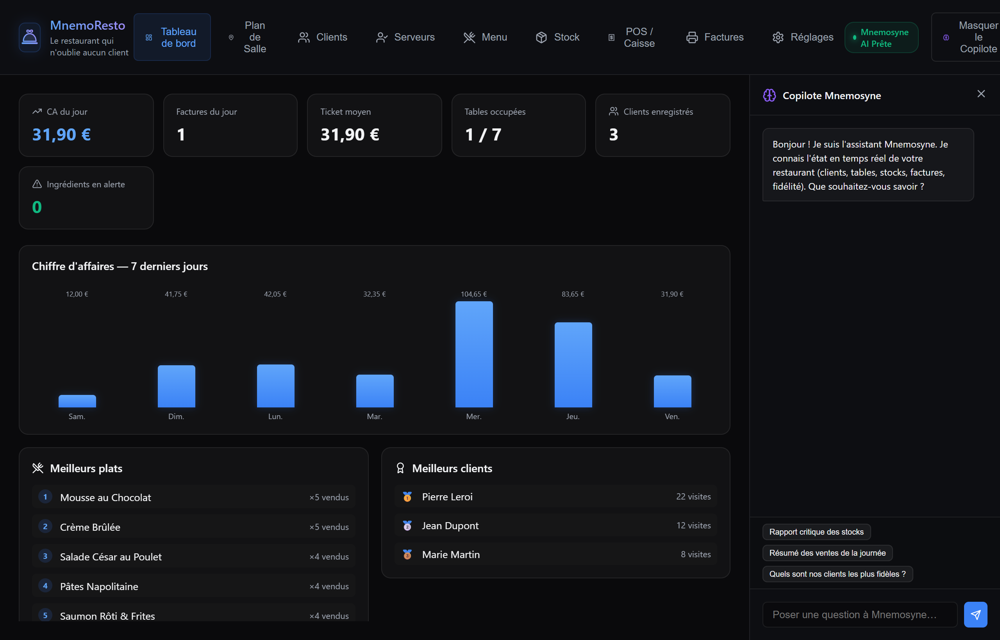
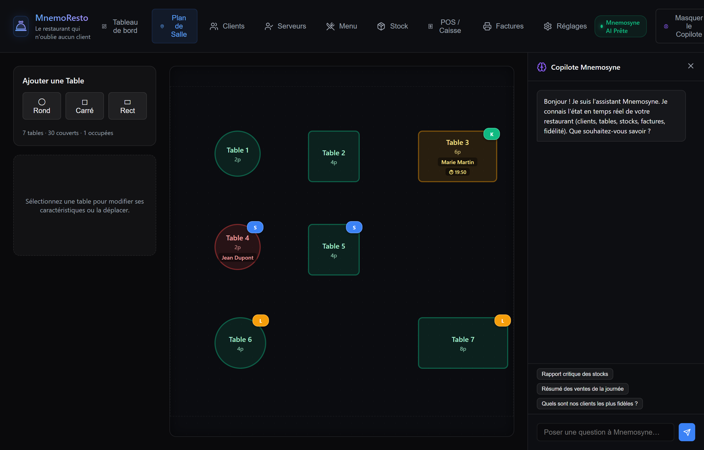
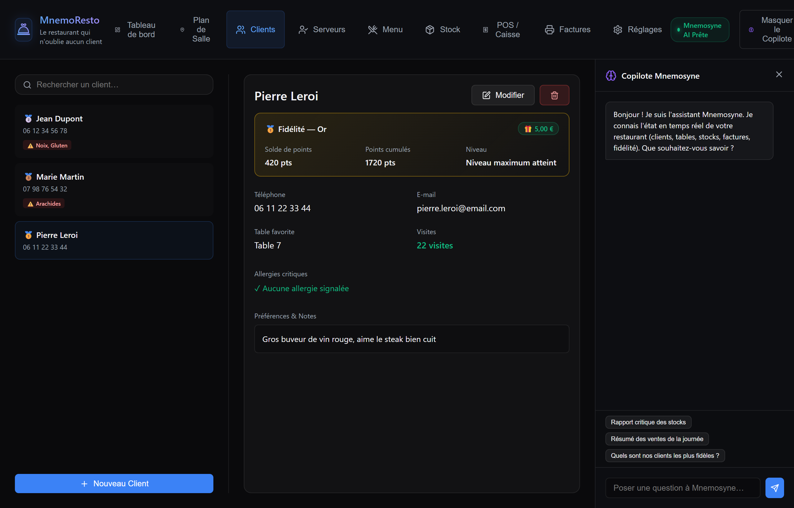
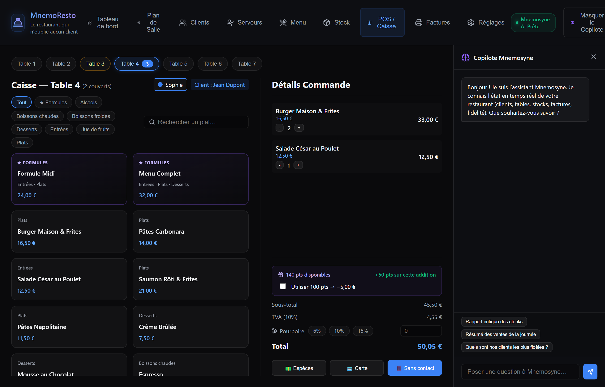
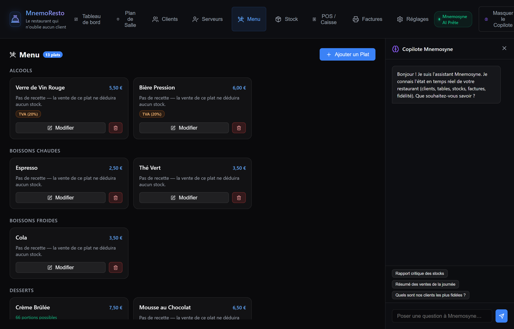
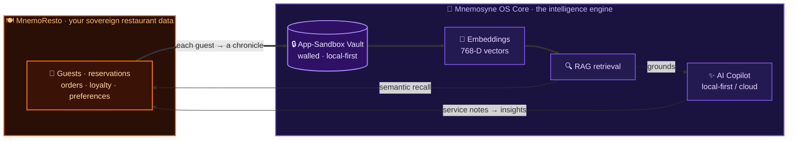

# 🍽️ MnemoResto — The Restaurant That Forgets No Guest

[](https://github.com/yaka0007/Mnemosyne-Neural-OS)
[](./LICENSE.md)

**MnemoResto** is a complete, offline-first restaurant management cartridge for **Mnemosyne OS**: floor plan, reservations, a guest CRM with loyalty, staff & tips, menu with combos and per-product VAT, inventory, register and invoicing — all in one sovereign, local-first workspace. Its promise: **a restaurant that never forgets a guest.**

> [!IMPORTANT]
> **MnemoResto is a cartridge — it runs inside Mnemosyne OS.** Install the host app first, then load this cartridge from MnemoHub (or link it in dev mode).
>
> [](https://github.com/yaka0007/Mnemosyne-Neural-OS/releases/latest) &nbsp; [](https://github.com/yaka0007/Mnemosyne-Neural-OS)



---

## ✨ Key Capabilities

### 📊 1. Dashboard & Floor Plan
- **Service dashboard** — the night at a glance: covers, turnover, active tables, tips.
- **Interactive floor plan** — lay out your room, seat guests, and track each table's live state.



### 📅 2. Reservations
- **One guest, one table** — with a *preferred table* and a one-tap **swap** when the room shifts.
- **Time + live countdown** to each booking, on an **iPhone-style wheel date/time picker**.

### 👥 3. Guest CRM & Loyalty
- A memory of every guest: contact, history, preferences, allergies — and a **loyalty** program that rewards regulars.
- *This is where the "forgets no guest" promise lives.*



### 🧾 4. POS, Combos & Invoicing
- **Multi-table POS** with **combos / set menus** (formules) and **per-product VAT**.
- **Register & billing** — issue invoices, track what's paid and what's open.



### 🧑‍🍳 5. Staff & Tips
- Assign servers to tables, track covers per server, and split **tips** fairly.

### 📦 6. Menu & Inventory
- Full **menu manager** (items, categories, combos, VAT) and **inventory / stock** tracking.



### 🤖 7. AI Copilot
- A built-in **Markdown copilot** that turns service data and free-text notes into readable summaries and insights — powered by the Mnemosyne OS model engine.

### 🌍 8. Trilingual, host-synced
- Full **EN / FR / ES** UI, kept in sync with the Mnemosyne OS host language.

---

## 🧠 Connected to the Mnemosyne OS Core

MnemoResto is not a standalone POS with an AI button bolted on — it's a **cartridge that plugs straight into the Mnemosyne OS intelligence engine**. The split is deliberate:

- **MnemoResto owns the data.** Your guests, reservations, orders, loyalty and preferences — the sovereign operational memory of *your* restaurant. It lives locally and is never sent to a third-party server.
- **Mnemosyne OS owns the intelligence.** Every guest and service note is ingested as a vectorized *chronicle* into a **walled app-sandbox vault** — isolated from the rest of your memory until you decide otherwise. From there the core engine brings that data to life:
  - **Semantic recall (RAG)** — ask *"which regulars haven't come back this month?"* or *"who's allergic to shellfish?"* in plain language and get grounded answers.
  - **Local-first AI Copilot** — turn a night's service notes into a clean summary, or draft a follow-up, with a model that runs on your machine.
  - **Embeddings** — 768-dimensional vectors let guest history be reasoned over by *meaning*, not keyword.

The intelligence comes **to** the data; the data never leaves your machine (an optional cloud model kicks in only when you choose it).



> Your restaurant's data stays in the walled vault on your own machine — the core simply brings the intelligence to it. Nothing is sent to a third-party server.

---

## 🚀 Installation & Running

To run the cartridge in sandbox/development mode:

```bash
# Install dependencies
npm install

# Start the local dev server
npm run dev
```

The app starts at `http://localhost:5203/`. You can run it standalone or load it as a cartridge inside a **Mnemosyne OS** host instance.

---

## 🧪 Testing

```bash
npm run test
```

The trilingual UI is guarded by a test that fails loudly if any EN/FR/ES locale key drifts out of sync — so a missing translation can never ship silently.

---

## ⚖️ License

Distributed under the **Mnemosyne OS Cartridge License**. You are free to inspect, modify, and customize the code as long as it executes and distributes within the **Mnemosyne OS** ecosystem.

For commercial use, redistribution outside the platform, or standalone hosting, please see the [LICENSE.md](./LICENSE.md) file.

---

<sub>**[Mnemosyne OS](https://mnemosyne-os.io)** — the sovereign, local-first memory OS this cartridge runs in.
Get it at [mnemosyne-os.io/download](https://mnemosyne-os.io/download), install cartridges from the built-in MnemoHub store, or [build your own](https://mnemosyne-os.io/dev).</sub>
